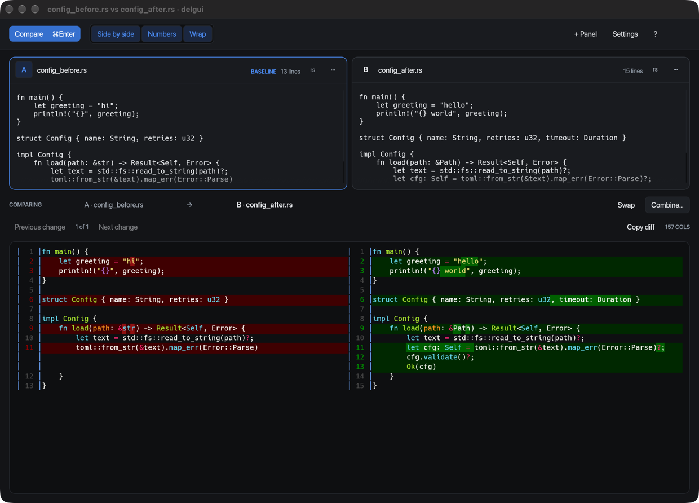

# delgui

**A paste-first GUI frontend for [`delta`](https://github.com/dandavison/delta).**

[](https://github.com/NicolasSchuler/delgui/actions/workflows/ci.yml)
[](LICENSE)
[](Cargo.toml)
[](https://github.com/dandavison/delta)

Two or more editable panels. Paste into both, press <kbd>⌘</kbd><kbd>⏎</kbd>, and get delta's
real output — same syntax highlighting, same word-level diff, same side-by-side layout as in
your terminal. Rendering is done by the actual `delta` binary, so it honours your `[delta]`
gitconfig section.

The gap it fills: delta assumes both sides already exist as paths. When they live in a
clipboard, a browser, or a log viewer, the workarounds are temp files, process substitution,
or a web diff tool you cannot paste confidential text into. delgui writes no temp files —
panel contents reach delta over pipes — and the only thing in the app that ever writes to disk
is an explicit **Save**.



## Contents

- [Requirements](#requirements)
- [Install](#install)
- [Quickstart](#quickstart)
- [Panels](#panels)
- [Building a result](#building-a-result)
- [Git integration](#git-integration)
- [Reading the diff](#reading-the-diff)
- [Keys](#keys)
- [Configuration](#configuration)
- [Development](#development)
- [Contributing](#contributing)
- [License](#license)

## Requirements

| | |
| --- | --- |
| `delta` | 0.18 or newer, on `PATH` — `brew install git-delta` or `cargo install git-delta` |
| `git` | delgui owns a hardened `git diff --no-index` step, then pipes the patch into delta |
| platform | macOS and Linux. Windows is not supported: panel contents reach delta as `/dev/fd/N` pipes. |

delta is a hard dependency, not a fallback. If it is missing, delgui says so and exits; it
does not substitute a renderer of its own. Everything is developed and measured on macOS.

## Install

The repository is private, so there is no public install channel yet: a Homebrew
formula and a `curl … | sh` installer both fetch release assets anonymously,
which a private repo refuses. Both are one config change away the moment it goes
public — see [RELEASING.md](RELEASING.md).

**From a release** — tagged releases attach prebuilt binaries for macOS (Apple
Silicon and Intel) and Linux x86-64. With the [`gh` CLI](https://cli.github.com),
authenticated as someone with access:

```sh
gh release download --repo NicolasSchuler/delgui --pattern '*aarch64-apple-darwin*'
tar xf delgui-aarch64-apple-darwin.tar.xz
install -m755 delgui-aarch64-apple-darwin/delgui ~/.local/bin/delgui
```

**From source** — needs Rust 1.87 or newer:

```sh
git clone git@github.com:NicolasSchuler/delgui.git
cd delgui
cargo build --release
./target/release/delgui
```

Or straight into `~/.cargo/bin`:

```sh
cargo install --git ssh://git@github.com/NicolasSchuler/delgui delgui
```

Either way delta is yours to install — `brew install git-delta`, or see
[delta's own instructions](https://github.com/dandavison/delta#installation).

Binaries are not signed or notarised, so macOS Gatekeeper will want a
right-click → **Open** the first time. There is no `.app` bundle: a
Finder-launched GUI inherits launchd's `PATH`, which has no `/opt/homebrew/bin`
in it, so it would report delta missing for most Homebrew users. That is a code
change rather than a packaging one.

## Quickstart

```sh
delgui                      # two empty panels, ready to paste into
delgui a.rs b.rs            # prefilled, compares immediately
delgui --paste file.rs      # clipboard into panel A, file into panel B
delgui --watch a.rs b.rs    # follow both files as they change on disk
delgui --combine a.rs b.rs  # start a result you can take differences into
delgui --hotkey             # register a system-wide paste hotkey
```

Try it on the bundled fixtures:

```sh
cargo run --release -- examples/config_before.rs examples/config_after.rs
```

Files can also be dragged onto any panel — drop several at once and they fill consecutive
panels, each outlined while you hover.

## Panels

Two panels to start; <kbd>⌘N</kbd> adds more, up to six. delta is a two-way tool, so one panel
is the **baseline** — click its letter — and the rest are diffed against it, one tab per pair.
There is no N-way diff and there is not meant to be. The strip under the panels always names
the pair on screen, so the direction of the diff is never something you have to infer from
which side is red.

A panel is **a buffer that may be backed by a file**. Untouched, it goes to delta as a path, so
delta infers the syntax itself. Type into it and it says *edited*, and from then on the buffer
is what gets compared; the file is still there to reload from or discard your edits back to.
Its ⋯ menu offers **follow changes on disk**, which keeps up with atomic-rename saves — how
most editors write — and which stands aside while you have unsaved edits rather than
overwriting them.

Each panel shows the syntax delta will use for it as a small chip: the file's extension, what
the content was sniffed as, or `prose`. Click it to say otherwise. Prose is detected as prose
and left unhighlighted, which is what you want when diffing paragraphs rather than code — the
detector is deliberately biased towards answering "don't know", because prose sprayed with
syntax colour is worse than prose left plain.

## Building a result

Two variants of a file, and you want some of this one and some of that one. **Combine…**, under
the diff, makes a **result** panel — seeded from any panel or from nothing — and gives it a
whole edge of the window.

The result is the baseline while you build it, so every diff on screen reads *my result against
a candidate*, and each difference carries one button that writes the candidate's version into
it. Switch candidate with the tabs, take from as many as you like, and type into the result for
anything no panel supplies. Then **Copy**, or **Save** it to a new file.

The result sits along the bottom by default, which costs the diff no width — delta lays out
against a column count, and side by side is the widest thing in the window. Its ⋯ menu moves it
to the **left** or **right** instead, the better trade on a wide screen: at 1600 px the diff
goes from 157 columns to 146, and the whole result is visible at once.

While you are building, the diff is computed with **no context lines**, so each independent
change is its own difference. It has to be: at git's default of three,
`examples/config_before.rs` and `config_after.rs` — thirteen lines with four separate changes —
come back as a *single* hunk, which is one button for the whole file.

Takes are undoable (<kbd>⌘Z</kbd> outside a text field), and a take that no longer fits the
result is refused rather than guessed at.

## Git integration

```sh
git config --global diff.tool delgui
git config --global difftool.delgui.cmd 'delgui "$LOCAL" "$REMOTE"'
git config --global merge.tool delgui
git config --global mergetool.delgui.cmd \
    'delgui --mergetool "$BASE" "$LOCAL" "$REMOTE" "$MERGED"'
git config --global mergetool.delgui.trustExitCode true
```

`git difftool` opens the two sides as panels. `git mergetool` opens BASE, LOCAL and REMOTE as
panels and seeds the result from the ancestor, which is what turns each side into differences
you can take — seeding from git's own half-merged file would mean diffing against its conflict
markers. <kbd>⌘S</kbd> writes MERGED and answers git: exit 0 stages the file, exit 1 leaves it
conflicted. The four paths are bound **by position**, because an empty ancestor is an ordinary
both-sides-added conflict and must not be filled in by "the first empty panel".

## Reading the diff

- **Navigate differences** with <kbd>⌘⌥↓</kbd> / <kbd>⌘⌥↑</kbd>, or the Previous/Next change
  buttons, with an *n of m* counter. This works in every comparison, not only while merging.
- **Find** with <kbd>⌘F</kbd>: a literal, case-sensitive substring scan over the rendered text,
  walked with <kbd>⌘G</kbd> / <kbd>⌘⇧G</kbd>. Being able to search the diff at all is half of
  why this parses delta's ANSI rather than embedding a terminal.
- **Filter what counts as a difference** in Settings: how much context to show (changes only,
  three lines, or the whole file), whether to ignore whitespace, blank lines, Windows line
  endings, or lines matching a pattern. What is being ignored is always printed beside the
  difference count — an ignore that silently suppresses a difference is the one way this can do
  harm. Ignores are forced off while a result is being built, because a take copies a
  difference's lines exactly.

## Keys

| | |
| --- | --- |
| <kbd>⌘O</kbd> | open a file in the shown panel |
| <kbd>⌘W</kbd> | close the window, with an unsaved-content guard |
| <kbd>⌘⏎</kbd> | re-render now (re-reads files from disk first) |
| <kbd>⌘F</kbd> · <kbd>⌘G</kbd> · <kbd>⌘⇧G</kbd> | find in the diff · next match · previous match |
| <kbd>⌘⌥↓</kbd> · <kbd>⌘⌥↑</kbd> | next difference · previous difference |
| <kbd>⌘N</kbd> · <kbd>⌘⇧W</kbd> | add a panel · remove the shown panel |
| <kbd>⌘⇧V</kbd> | paste into a fresh panel |
| <kbd>⌘R</kbd> | make the shown panel the baseline |
| <kbd>⌘1</kbd>…<kbd>⌘6</kbd> | show that panel's diff |
| <kbd>⌘S</kbd> · <kbd>⌘⇧S</kbd> | save the result · save it as a new file |
| <kbd>⌘Z</kbd> · <kbd>⌘⇧Z</kbd> | undo · redo the last take (only outside a text field) |
| <kbd>⌘⌥S</kbd> · <kbd>⌘L</kbd> · <kbd>⌘\\</kbd> | side by side · line numbers · wrap |
| <kbd>⌘,</kbd> · <kbd>⌘/</kbd> | settings · show this list |

Off macOS these are the same chords with <kbd>Ctrl</kbd>. Everything else lives in each panel's
⋯ menu — open, reload, discard edits, follow the file, clear, remove. Every operation that could
replace unsaved panel text asks first. The full table, both platforms, is in
[`docs/reference.md`](docs/reference.md#keyboard).

`--hotkey` registers <kbd>⌘⇧D</kbd> system-wide, which focuses the window and pastes the
clipboard into a fresh panel. It works only while delgui is running — an application cannot
arrange to be *launched* by a hotkey; that is a job for launchd, Raycast, or a keyboard tool.

## Configuration

Every option, default and flag mapping is documented in
**[`docs/reference.md`](docs/reference.md)**, which is generated from the source. In short:

**Appearance** follows your system light/dark setting by default, and either way the whole
window agrees with the diff inside it: the theme sets delta's own `--light`/`--dark`, so its red
and green backgrounds are the ones meant for that mode. You can pick the interface and diff
fonts from what is installed — delgui measures the one you choose and says so if it is not
really monospaced, since delta lays its output out in columns.

**delta** shows what your gitconfig already tells delta, which `[delta "name"]` presets exist
and lets you switch them on, and offers delta's syntax themes, labelled light or dark with one
click to match the window to them. Turning off *use my `[delta]` gitconfig* passes
`--no-gitconfig`, which is the only way to get output independent of your gitconfig and working
directory — `GIT_CONFIG_GLOBAL` does not work, delta ignores it.

**Render pipeline** shows the owned `git diff … | delta …` shape and every flag that affects the
result. The `/dev/fd/N` operands name private in-memory panel snapshots, so the display is
explanatory rather than a directly runnable shell command.

Preferences are remembered; panel contents never are.

## Development

| path | role |
| --- | --- |
| `crates/delgui-core` | delta invocation + ANSI→span parsing, no GUI deps |
| `crates/delgui` | egui frontend: state, theme, fonts, keymap, hotkey |
| `docs/reference.md` | generated configuration and feature reference |
| `dist-workspace.toml` | what a tagged release builds and publishes |
| `docs/research.md` | the measurements the design rests on |

`delgui-core` is deliberately frontend-agnostic so a ratatui frontend stays a real option
rather than an aspiration.

```sh
cargo build --release
cargo test                                           # whole workspace
cargo clippy --workspace --all-targets
DELGUI_BLESS=1 cargo test -p delgui docs::   # regenerate docs/reference.md
```

The suite runs against **your installed delta**, not a fixture, and asserts among other things
that the parser understands every escape sequence delta emits. A delta upgrade that changes its
output is *meant* to fail a test rather than mis-render silently. Some watch tests sleep on real
filesystem events, so the suite is not instant.

[`docs/research.md`](docs/research.md) records the measurements the design rests on — including
a gotcha that affects the plain shell workflow too: **delta infers syntax from the right-hand
path only**, so `delta file.rs <(pbpaste)` silently loses highlighting where
`delta <(pbpaste) file.rs` keeps it.

## Contributing

Issues and pull requests are welcome. CI builds and tests on macOS and Linux
against a real delta, and runs weekly so that a delta release which changes its
output shows up as a failing test rather than as a mis-render. Releases are cut
by pushing a tag; see [RELEASING.md](RELEASING.md).

Three house rules:

- **Do not run `cargo fmt`.** The code is hand-formatted in a deliberately compact style with no
  `rustfmt.toml`; a blanket reformat would reflow files unrelated to your change. Match the
  surrounding layout by hand.
- **Do not edit `docs/reference.md`.** It is generated — change `crates/delgui/src/docs.rs`
  and re-bless it. A test fails otherwise.

Comments explain *why*, especially where a line encodes a measured finding about delta or the
platform. Commit messages follow the same rule: a short imperative subject, then prose
explaining the reasoning and what a test now pins down.

## License

MIT. See [LICENSE](LICENSE).

delta itself is a separate project under its own licence, and is not redistributed here —
delgui runs whichever copy is on your `PATH`.
