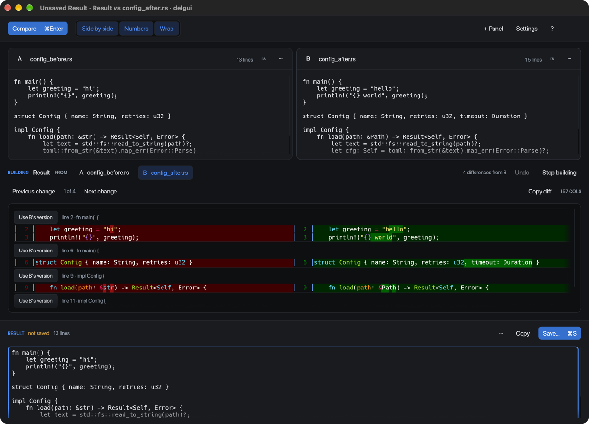

# delgui

**A paste-first GUI frontend for [`delta`](https://github.com/dandavison/delta).**

[](https://github.com/NicolasSchuler/delgui/actions/workflows/ci.yml)
[](LICENSE)
[](Cargo.toml)
[](https://github.com/dandavison/delta)

Two or more editable panels. Paste into both, press <kbd>⌘</kbd><kbd>Enter</kbd>, and get delta's
real output — same syntax highlighting, same word-level diff, same side-by-side layout as in
your terminal. Rendering is done by the actual `delta` binary, so it honours your `[delta]`
gitconfig section.

The gap it fills: delta assumes both sides already exist as paths. When they live in a
clipboard, a browser, or a log viewer, the workarounds are temp files, process substitution,
or a web diff tool you cannot paste confidential text into. delgui hands panel contents to delta
over pipes, without temporary files, and writes a file only when you **Save** a result.


## Contents

[Requirements](#requirements) · [Install](#install) · [Quickstart](#quickstart) ·
[Comparing](#comparing) · [Merge two versions into one](#merge-two-versions-into-one) ·
[Use with git](#use-with-git) · [Reading the diff](#reading-the-diff) · [Keys](#keys) ·
[Configuration](#configuration) · [Troubleshooting](#troubleshooting) ·
[Contributing](#contributing)

## Requirements

| | |
| --- | --- |
| `delta` | 0.18 or newer, on `PATH` — `brew install git-delta` or `cargo install git-delta` |
| `git` | any version, on `PATH` — delgui runs `git diff --no-index` and pipes the patch into delta |
| platform | macOS and Linux. Windows is not supported: panel contents reach delta as `/dev/fd/N` pipes. |

## Install

**From source** — needs Rust 1.87 or newer, plus delta (`brew install git-delta`, or see
[delta's instructions](https://github.com/dandavison/delta#installation)):

```sh
git clone git@github.com:NicolasSchuler/delgui.git
cd delgui
cargo install --path crates/delgui    # puts delgui in ~/.cargo/bin
```

`cargo build --release` instead leaves the binary at `target/release/delgui`. On Linux the build
also needs GTK 3, xkbcommon and Wayland headers — on Debian or Ubuntu,
`sudo apt-get install libgtk-3-dev libxkbcommon-dev libwayland-dev`.

**From the v0.2.0 release** — prebuilt binaries for macOS (Apple Silicon and Intel) and Linux
x86-64. The repository is private, so downloading needs the [`gh` CLI](https://cli.github.com)
signed in as someone with access; there is no Homebrew formula or install script yet
([RELEASING.md](RELEASING.md) says why).

```sh
gh release download v0.2.0 --repo NicolasSchuler/delgui --pattern '*aarch64-apple-darwin*'
tar xf delgui-aarch64-apple-darwin.tar.xz
install -m755 delgui-aarch64-apple-darwin/delgui ~/.local/bin/delgui
```

Use `x86_64-apple-darwin` on an Intel Mac and `x86_64-unknown-linux-gnu` on Linux. The binaries
are not signed or notarised, and delta is not included.

## Quickstart

```sh
delgui                      # two empty panels, ready to paste into
delgui a.rs b.rs            # compare two files
delgui --paste file.rs      # clipboard into panel A, file into panel B
delgui --watch a.rs b.rs    # re-compare whenever either file is saved
delgui --combine a.rs b.rs  # start a result you can take differences into
delgui --hotkey             # also register a system-wide paste hotkey
delgui --help               # every flag, and the git recipe
```

On macOS, start delgui from a terminal ([Troubleshooting](#troubleshooting) says why). Files can
also be dragged onto panels. A pair compares as soon as it is loaded, up to 1 MB of combined input;
larger pairs wait for **Compare** (<kbd>⌘Enter</kbd>). In a checkout,
`delgui examples/config_before.rs examples/config_after.rs` is a small pair to try.

## Comparing

Two panels to start; <kbd>⌘N</kbd> adds more, up to six. delta compares two things at a time, so
one panel is the **baseline** — click a panel's letter to choose it — and every other panel is
diffed against it, one tab per pair. The strip under the panels names the pair on screen, and
**Swap** (<kbd>⌘⇧R</kbd>) reads the same pair the other way round: what was removed is now added.

A panel is a buffer that may be backed by a file. Type into it and it is marked *edited*, and
your buffer is what gets compared; its ⋯ menu can reload the file or discard your edits.
**Follow changes on disk**, in the same menu, re-compares whenever the file is saved, and leaves
an edited panel alone rather than overwrite your typing.

Each panel shows the syntax delta will use as a small chip: the file's extension, what pasted
content looks like, or `prose`, which is left unhighlighted. Click the chip to choose another.

## Merge two versions into one

1. Load the versions into panels — `delgui ours.rs theirs.rs`, or paste or drop them.
2. Click **Combine…** under the panels and pick what the result starts from: a panel, or
   **Start empty**. `delgui --combine` does this for you, starting from the first panel.
3. A **result** panel appears along the bottom and becomes the baseline, so the diff now reads
   *result against candidate*. While building, every separate change is its own difference.
4. Each difference has a control row. **Use B's version** writes the candidate's lines into the
   result; <kbd>⌘⇧Enter</kbd> takes the current difference and <kbd>⌘⌥↓</kbd>/<kbd>⌘⌥↑</kbd> move
   between them. Switch candidate with the tabs, and type into the result for anything no panel
   supplies. <kbd>⌘Z</kbd> undoes a take when no text field has focus.
5. **Save** with <kbd>⌘S</kbd> (the first save asks where), **Save as…** with <kbd>⌘⇧S</kbd>, or
   **Copy** it.



**Stop building** puts the take controls away and keeps the text. The result's ⋯ menu moves it
to the left or right edge, to see all of it at once on a wide screen.

## Use with git

```sh
git config --global diff.tool delgui
git config --global difftool.delgui.cmd 'delgui "$LOCAL" "$REMOTE"'
git config --global difftool.prompt false
git config --global merge.tool delgui
git config --global mergetool.delgui.cmd \
    'delgui --mergetool "$BASE" "$LOCAL" "$REMOTE" "$MERGED"'
git config --global mergetool.delgui.trustExitCode true
```

**As a diff tool**, `git difftool` opens one window per changed file, old version against new,
and moves on to the next file when you close it. `difftool.prompt false` above stops git asking
before each file; `git difftool -y` does the same for one run.

**As a merge tool**, `git mergetool` opens one window per conflicted file:

1. The common ancestor (BASE), your side (LOCAL) and theirs (REMOTE) become panels A, B and C.
2. The result starts as the ancestor, so each side's changes arrive as differences to take —
   not as git's conflict markers.
3. Take from B and C as in [the walkthrough above](#merge-two-versions-into-one). Where both
   sides changed the same lines, take one and edit the result by hand.
4. <kbd>⌘S</kbd> writes the merge to git's file. Saving a result you have not changed asks first.
   **Export copy…** writes somewhere else and does not resolve the conflict.
5. Close the window. With `trustExitCode`, delgui exits 0 if git's file holds your merge, and git
   stages it; if you closed without saving, or edited again after saving, it exits 1 and git
   leaves the file conflicted. The [reference](docs/reference.md#as-gits-diff-and-merge-tool)
   has the details.

## Reading the diff

- **Differences**: <kbd>⌘⌥↓</kbd> / <kbd>⌘⌥↑</kbd> or the Previous/Next buttons walk them, with an
  *n of m* counter, in every comparison.
- **Find**: <kbd>⌘F</kbd> searches the rendered diff for literal, case-sensitive text;
  <kbd>⌘G</kbd> / <kbd>⌘⇧G</kbd> walk the matches.
- **Highlight**, in Settings → delta: how much of a changed line is picked out — single
  characters (the default, so a `<` that became `<=` is not missed), whole words (delta's own
  default), or nothing within the line.
- **What counts as a difference**, in Settings → differences: how much context to show (changes
  only, three lines, or the whole file), and whether to ignore whitespace, blank lines, Windows
  line endings, or lines matching a pattern. Whatever is ignored is printed beside the difference
  count, and ignores are off while building a result, where a take copies lines exactly.

## Keys

| | |
| --- | --- |
| <kbd>⌘Enter</kbd> | Compare: re-read files from disk and render now |
| <kbd>⌘⇧R</kbd> | swap the two sides |
| <kbd>⌘⌥↓</kbd> · <kbd>⌘⌥↑</kbd> | next · previous difference |
| <kbd>⌘F</kbd> · <kbd>⌘G</kbd> · <kbd>⌘⇧G</kbd> | find · next match · previous match |
| <kbd>⌘⇧Enter</kbd> · <kbd>⌘S</kbd> | take the current difference · save the result |
| <kbd>⌘,</kbd> | settings |
| <kbd>⌘/</kbd> | every shortcut |
| <kbd>⌘Q</kbd> | quit, asking first if anything is unsaved |

Off macOS, use <kbd>Ctrl</kbd> for <kbd>⌘</kbd> and <kbd>Alt</kbd> for <kbd>⌥</kbd>. The full
list, for both platforms, is in [`docs/reference.md`](docs/reference.md#keyboard).

| mouse | |
| --- | --- |
| drop files on a panel | load them; several at once fill consecutive panels |
| click a panel's letter (A, B, …) | make that panel the baseline |
| ⋯ on a panel | open, reload, follow on disk, clear, remove |

`--hotkey` registers <kbd>⌘⇧D</kbd> (<kbd>Super</kbd><kbd>⇧</kbd><kbd>D</kbd> on Linux)
system-wide, while delgui runs: it brings the window forward and pastes into a fresh panel.

## Configuration

Settings (<kbd>⌘,</kbd>) cover the theme and fonts, delta's syntax theme and highlighting, the
difference filters above, and which `[delta "name"]` feature presets are on. The theme follows
your system and is passed to delta as `--light`/`--dark`, so the diff matches the window.
Turning off *Use my `[delta]` gitconfig* passes `--no-gitconfig`, the only way to get output
independent of your gitconfig — delta ignores `GIT_CONFIG_GLOBAL`. Preferences are remembered;
panel contents never are. Every option, default and flag mapping is in
**[`docs/reference.md`](docs/reference.md)**, generated from the source.

## Troubleshooting

**"`delta` was not found on PATH"** — install it (`brew install git-delta`). If it is installed,
check how delgui was started: it finds delta (and `git`) only through `PATH`. Launched from
Finder, the Dock or another macOS launcher, it gets launchd's `PATH`, which has no
`/opt/homebrew/bin`, so a Homebrew delta looks missing — which is also why there is no `.app`
bundle yet. Start delgui from a terminal, or from a wrapper that puts Homebrew's `bin` on `PATH`.

**"found delta …, but delgui needs at least 0.18"** — upgrade delta. Debian and Ubuntu packages
lag well behind; use `cargo install git-delta` or
[delta's releases](https://github.com/dandavison/delta/releases) instead.

**Pasted text is not highlighted** — delta picks a syntax from the right-hand file's name, and
pasted text has none, so delgui guesses from the content and answers `prose` when unsure. Click
the chip under the panel to set the language (passed as `--default-language`), or load the text
from a file with the right extension.

**A large pair does not render** — above 1 MB of combined input, delgui waits for **Compare**
(<kbd>⌘Enter</kbd>) rather than re-rendering on every keystroke. A panel over 4 MB is refused.

**The render timed out** — larger input gets more time, but a big pair shown in full can still
run out. Set Settings → differences → Show to *Changes only*, or compare smaller pieces.

## Contributing

Building, testing and the house rules are in [CONTRIBUTING.md](CONTRIBUTING.md).

## License

MIT. See [LICENSE](LICENSE). delta is a separate project under its own licence and is not
redistributed here — delgui runs whichever copy is on your `PATH`.
